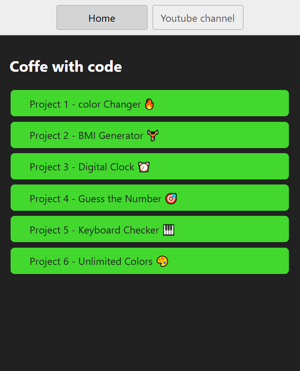

# JavaScript Projects

This repository contains a collection of beginner-friendly JavaScript projects designed to demonstrate key concepts of JavaScript and DOM manipulation. Each project is small, interactive, and focused on a specific use case to make learning fun and practical.

---

## Features

- **Interactive and Engaging**: Hands-on projects that respond to user inputs.
- **Easy to Understand**: Simple and clean code structure for easy learning.
- **Practical Use Cases**: Each project solves a specific problem or performs a fun task.

---

### Live Demo

You can view the live demo of the landing page at [https://stackblitz.com/edit/stackblitz-starters-du7qts].

#### Getting Started

To get a local copy of the project up and running, follow these steps:
Clone the repository: https://github.com/mohdfurkan01/javascript-logic_building-projects

## Tech Stack

- **Frontend**:
  - HTML for structure
  - CSS for styling
  - JavaScript for functionality

---

## Folder Structure

javascript-projects/  
│  
├── color-changer/ # Color Changer project  
├── bmi-generator/ # BMI Generator project  
├── digital-clock/ # Digital Clock project  
├── guess-the-number/ # Guess the Number game  
├── keyboard-checker/ # Keyboard Checker app  
└── unlimited-colors/ # Unlimited Colors generator

---

### Overview

### color Changer 🔥

### BMI Generator 🏋️‍♂️

### Digital Clock ⏰

### Guess the Number 🎯

### Keyboard

### Unlimited Colors 🎨

Simply click on any project you want to explore, and you'll see it presented nicely along with a live version!
